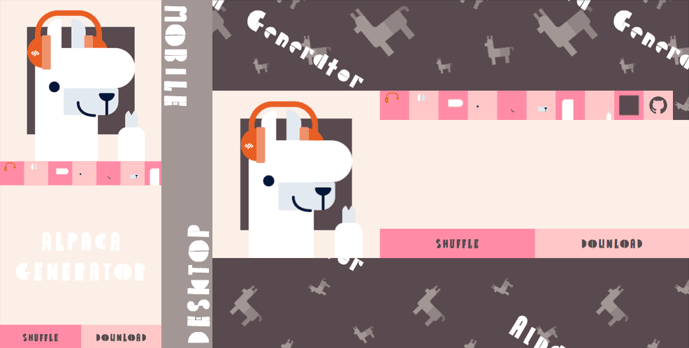

# 練習專案：羊駝紙娃娃

專案展示：https://tzynwang.github.io/Practice_alpaca-generator/

# 框架
- [Vue.js](https://vuejs.org/): v2.x

# 功能
- 使用者可自行挑選想組合的羊駝部件
- 提供隨機產生功能
- 提供下載圖片功能

# 技術參考
## CSS
- [Emojis as Favicons](https://css-tricks.com/emojis-as-favicons/)
- [SVG, Favicons, and All the Fun Things We Can Do With Them](https://css-tricks.com/svg-favicons-and-all-the-fun-things-we-can-do-with-them/)
- [How do I remove the space between inline/inline-block elements?](https://stackoverflow.com/questions/5078239/how-do-i-remove-the-space-between-inline-inline-block-elements)
- [Use CSS to remove the space between images](https://stackoverflow.com/questions/7641678/use-css-to-remove-the-space-between-images)
- [Pure css infinite background animation](https://codepen.io/kootoopas/pen/reyqg)
## JavaScript
- [Metaprogramming: An Introduction to JavaScript(ES6) Proxy](https://blog.greenroots.info/metaprogramming-an-introduction-to-javascriptes6-proxy)
- [MDN: Proxy](https://developer.mozilla.org/en-US/docs/Web/JavaScript/Reference/Global_Objects/Proxy)

# 銘謝
- [Alpaca image generator](https://www.codementor.io/projects/web/alpaca-image-generator-website-ce2oc0eus8)：練習題目出處
- [flaticon](https://www.flaticon.com/pattern/)：圖樣背景產生器
- [Google Fonts: Palette Mosaic](https://fonts.google.com/specimen/Palette+Mosaic)：字體
- [Happy Hues: palettes 15](https://www.happyhues.co/palettes/15)：配色參考